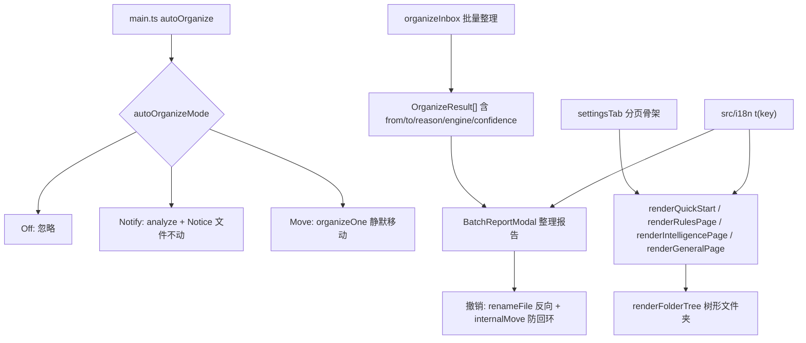

# Technical Design — 批量整理报告与设置体验升级

Feature Name: batch-report-settings-ux
Updated: 2026-09-16
Requirements: ./requirements.md
Version Target: 0.3.0

## Description

五大交付物：整理报告面板（逐篇明细 + 单篇/整批撤销）、实时归档三态开关、设置面板分页、树形文件夹、UI 中英切换（i18n 字典）。实现顺序：R2 → R4 → R1 → R3 → R5（小改动先行，R3/R5 依赖对 settingsTab 的大改，最后统一重构）。

## Architecture



## Components and Interfaces

### 1. 实时归档三态（R2）

```ts
// settings.ts
export enum AutoOrganizeMode { Off = 0, Notify = 1, Move = 2 }
// SmartNotesSettings.autoOrganize: boolean → autoOrganizeMode: AutoOrganizeMode
// 迁移：loadSettings 时旧字段存在则映射（true→Move, false→Off），迁移后删除旧字段
```

main.ts autoOrganize 拆两路：Move 走现有 organizeOne；Notify 调 organizerService.analyze 后 Notice `「标题」建议移至 X（依据）——可在设置中开启直接归档`。观察 rename/create 事件处 autoOrganize 布尔判断同步替换。

### 2. 整理报告面板（R1）

```ts
// fileOrganizer.ts OrganizeResult 扩展（现有字段基础上补齐）
interface OrganizeResult {
  file: string; from: string; to: string;
  moved: boolean; engine: EngineLevel; reason: string; confidence: number;
  // moved=false 时 to 为空，reason 说明保留原因
}
// organizeInbox 返回 OrganizeResult[]（核对现有返回结构并补齐缺失字段）
```

新文件 `src/ui/batchReportModal.ts`：
- `class BatchReportModal extends Modal`：构造参数 `(app, plugin, results: OrganizeResult[])`
- 分区：已移动（N 篇）/ 保留原位（M 篇）/ 底部「全部撤销」按钮
- 撤销单条：`plugin.internalMove = true` → `app.fileManager.renameFile(file, from)` → 条目状态更新；完成 Notice「已移回原位」
- 整批撤销：仅对当前状态为已移动的条目，按报告顺序逆序执行；单条失败跳过并在条目标注，最后汇总「撤销 N 篇，失败 M 篇」
- 原路径占用冲突：renameFile 前检查目标存在，存在则追加 `（撤销恢复）-1` 序号
- 撤销写入整理日志（from/to 对调，engine 字段标注 undo）——ActivityLog 增加可选 engine 标注参数

### 3. 设置面板分页（R3）

settingsTab.display() 重构为骨架 + 四个 render 方法：

```ts
display(): void {
  // 顶部：关键引导（种子规则未导入等，跨页显示）
  // tab 栏: [入门与引擎, 规则与文件夹, 智能与模型, 通用与日志]
  // containerEl 按 activeTab 切换 display:none，render 对应页
}
// 入门与引擎: 快速入门 + 引擎选择
// 规则与文件夹: 层级一规则列表 + 种子导入 + 从已有文件夹开始(树形) + custom_rules.json
// 智能与模型: 层级二(TF-IDF) + 层级三(Ollama) + 层级四(共享配置)
// 通用与日志: 实时归档三态 + Inbox/排除/日志设置 + 语言切换 + 整理记录
```

记住分页：`plugin.settings.lastSettingsTab: string`（默认首页），切页时保存。

### 4. 树形文件夹（R4）

```ts
// userFolders.ts 扩展
interface UserFolderNode { path: string; name: string; noteCount: number; depth: number }
export const MAX_TREE_NODES = 200
export function filterUserFolderTree(
  folders: { path: string; noteCount: number }[],
  excludedFolders: string[]
): UserFolderNode[]   // 任意深度、depth 计算、排序同现有字典序
// vaultFolders.ts collectUserFolderTree(app, excluded): 递归遍历 TFolder 树
```

渲染：`<details>/<summary>` 原生折叠（零 JS 状态），noteCount=0 节点加冷启动文案，每节点「建规则」按钮（复用现有草稿预填逻辑）。nodes > MAX_TREE_NODES 时默认折叠非首级（details 不带 open 属性）。

### 5. i18n（R5）

```ts
// src/i18n/zh.ts  export const zh = { "settings.engine.title": "整理引擎", ... }
// src/i18n/en.ts  export const en: Partial<typeof zh> = { ... }  // 缺失回退中文
// src/i18n/index.ts
export type Locale = "zh" | "en";
export function setLocale(locale: Locale): void
export function t(key: keyof typeof zh): string   // en[key] ?? zh[key]
// 设置: settings.locale: "zh" | "en" | "auto"（默认 auto → moment.locale() 前缀 zh→中文）
```

settingsTab / batchReportModal / main.ts 全部 Notice 与面板文案替换为 t(key)。命令描述（manifest 侧 commands 在 main.ts addCommand 注册）同步走 t()。抽词范围以 settingsTab.ts 现有字符串清单为准，一次性机械替换。

## Data Models

- `SmartNotesSettings` 新增：`autoOrganizeMode: AutoOrganizeMode`（迁移替代 autoOrganize）、`locale: "zh" | "en" | "auto"`、`lastSettingsTab: string`
- `OrganizeResult` 补齐 reason/confidence 字段（现有 organizeInbox 已返回部分）
- ActivityLog 条目 engine 字段允许 `undo` 标注

## Correctness Properties

- P1：撤销后文件回到报告中的 from 路径（或其防冲突变体），内部链接由 renameFile 自动更新
- P2：撤销操作不触发整理（internalMove 防回环生效）
- P3：autoOrganize 旧设置迁移后行为等价（true 用户升级后仍静默移动）
- P4：filterUserFolderTree 输出无排除命中节点、depth 正确、字典序稳定
- P5：t() 对缺失英文 key 回退中文，永不抛错
- P6：Notify 模式下 analyze 全程零文件写入

## Error Handling

| 场景 | 处理 |
|------|------|
| 撤销目标路径被占用 | 追加序号重命名并在条目说明（R1.5） |
| 撤销时文件已被用户手动移走 | renameFile 抛错 → 条目标注「文件已不在预期位置」，跳过 |
| 整批撤销部分失败 | 逐条 try/catch，汇总失败数 |
| 旧设置迁移 | loadSettings 容错，异常时回落 Off |
| i18n key 缺失 | 回退中文 |

## Test Strategy

纯逻辑单测（tests 不 import obsidian）：

- tests/autoOrganizeMode.test.ts：布尔 → 三态迁移映射（P3）
- tests/userFolders.test.ts 扩展：树形过滤 depth/排除/200 截断（P4）
- tests/i18n.test.ts：回退逻辑（P5）、key 完整性（en 的 key 集合 ⊆ zh）、抽查关键 key 非空
- tests/ruleDescribe.test.ts 回归保持
- OrganizeResult 字段补齐 + 撤销序生成逻辑抽纯函数（undoPath 计算防冲突命名）测试

UI 行为（分页切换、树折叠、报告面板）依赖 Obsidian 容器，走 build + 真机验证。

## References

- src/main.ts:208-220 — autoOrganize 现状（静默移动）
- src/services/fileOrganizer.ts — organizeInbox / OrganizeResult / internalMove
- src/services/userFolders.ts — filterUserFolders（树形化基础）
- src/settings/settingsTab.ts — display() 重构对象
- src/engines/tfidf/tfidf.ts — reason/confidence 数据源
