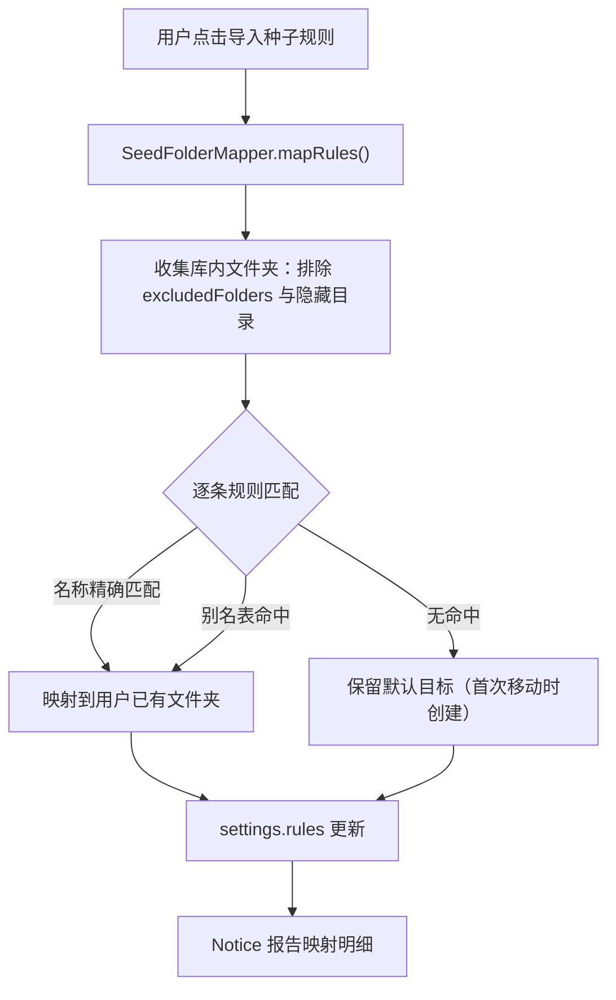
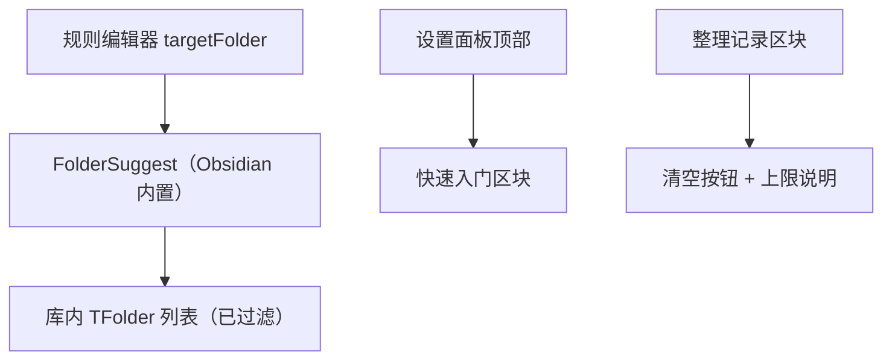

# 存量库用户落地体验（Existing Vault Adoption）

Feature Name: existing-vault-adoption
Updated: 2026-09-14

## Description

响应 0.1.1 真机验证后的四项用户反馈，让插件融入存量库用户已有目录体系，并补齐设置指导与日志管理能力。四个改动点：

1. 种子规则集导入时自动映射复用库内已有文件夹（核心）。
2. 规则编辑器目标文件夹改为从库内文件夹列表选择（FolderSuggest）。
3. 设置面板顶部内嵌快速入门 + 分区一句话说明。
4. 整理记录区块补清空按钮与 200 条上限说明。

全部并入 V0.2 发版（与 custom_rules.json、英文分词同版本）。

## Architecture





## Components and Interfaces

### 1. SeedFolderMapper（新增，`src/services/seedFolderMapper.ts`）

纯函数模块，无 Obsidian 运行时依赖（文件夹列表由调用方传入），可单测。

```ts
export interface SeedMappingResult {
  ruleId: string;
  defaultFolder: string;
  mappedFolder: string;
  reused: boolean;   // true = 复用用户已有文件夹
}

/** 返回每个种子规则的最终目标文件夹（复用或默认） */
export function mapSeedFolders(
  vaultFolders: string[],
  defaultTargets: string[],
  excludedFolders: string[]
): SeedMappingResult[];

/** 收集库内文件夹相对路径（过滤隐藏目录与排除项），供 mapper 与 FolderSuggest 共用 */
export function collectFolderPaths(app: App, excludedFolders: string[]): string[];
```

别名表（全小写、大小写不敏感匹配，多命中取路径最短者）：

| 默认目标 | 别名 |
|---------|------|
| 日志 | daily, daily-notes, journal, journals, diary, 日记, 日志, logs, log |
| 归档 | archive, archives, archived, 存档 |
| 收件箱 | inbox, inboxes, 收集箱, collection |

匹配顺序：`路径（或末段）全小写 trim` 等于默认目标 → 命中别名表 → 保留默认。保守策略：仅精确与别名匹配，不做包含式模糊匹配，避免误映射。

### 2. FolderSuggest 集成（修改 `src/settings/settingsTab.ts`）

规则编辑器中 targetFolder 文本输入框替换为 Obsidian 内置 `FolderSuggest`（`import { FolderSuggest } from "obsidian"`），候选项来自 `collectFolderPaths()`，同时保留手动输入能力（Suggest 类天然支持）。

### 3. 设置面板快速入门（修改 `src/settings/settingsTab.ts`）

`display()` 顶部（"整理引擎" h2 之前）新增快速入门区块：

- 一段工作原理说明：投入 Inbox → 点击 Ribbon（或自动监听）→ 移动 + 链接自动更新。
- 三步首次配置清单：确认 Inbox 文件夹名 → 导入种子规则集（自动复用已有文件夹）→ 用一篇笔记试运行。
- TF-IDF 分区补充说明：从已有文件夹学习特征向量，无需配置。

各分区标题（层级一/二/三/四/通用设置/日志）补一句话描述。

### 4. ActivityLog.clear（修改 `src/services/fileOrganizer.ts`）

```ts
async clear(): Promise<void>  // 写入空数组 []
```

整理记录区块增加：上限说明文字（"仅保留最近 200 条，超出自动丢弃最旧"）、清空按钮（点击后刷新展示区）、enableLog 关闭时的行为说明。

## Data Models

无新增持久化结构。`organize-log.json` 与 `data.json` 结构保持不变。别名表为代码内常量（`SEED_ALIASES`），随插件版本演进。

## Correctness Properties

1. 映射是只读操作：`mapSeedFolders` 对库文件零写入，文件创建只发生在后续整理移动时（沿用 `FileOrganizer.ensureFolder`）。
2. 幂等：重复导入种子规则，规则 id 去重逻辑不变；映射结果在库结构不变时保持一致。
3. 排除优先：`excludedFolders` 与隐藏目录（`.` 开头）中的文件夹永不参与映射与 Suggest 候选。
4. 日志上界不变：`clear()` 后日志为空数组，后续 append 仍受 200 条上限约束。
5. 映射失败不影响导入：任一规则匹配异常时该规则保留默认目标，导入流程继续。

## Error Handling

| 场景 | 处理 |
|------|------|
| 库内无任何文件夹（新库） | 全部保留默认目标，Notice 报告 0 复用 |
| 同一别名命中多个文件夹（如 `Archive` 与 `archive/old`） | 取路径最短（最顶层）者 |
| organizer-log.json 写入失败 | 沿用现有 try-catch 静默策略，Notice 提示清空失败 |
| FolderSuggest 无候选（排除后为空） | 退化为普通文本输入 |

## Test Strategy

Vitest 单测（`tests/seedMapper.test.ts`）：

- 精确匹配：库内有「日志」→ 映射且 reused=true
- 别名匹配：库内有 `Daily`（大小写混合）→ 日志规则复用
- 别名表全量：3 条默认目标 × 各别名逐个命中
- 多命中取最短路径
- 排除文件夹与隐藏目录被过滤
- 无命中保留默认且 reused=false
- `collectFolderPaths` 过滤逻辑（mock App.vault）

`tests/helpers.test.ts` 或新增用例：ActivityLog.clear 清空后 read 返回空数组。

设置面板改动以手动真机验证为主（与阶段2验证清单合并执行）。

## References

[^1]: 当前工作区 `src/settings/settingsTab.ts#L257` - 现有种子规则导入入口
[^2]: 当前工作区 `src/services/fileOrganizer.ts#L16` - MAX_LOG_ENTRIES = 200
[^3]: 当前工作区 `src/engines/ruleEngine.ts#L53` - defaultRules 种子规则集
[^4]: 当前工作区 `.monkeycode/docs/product-roadmap.md` - 产品定位与版本路线图
