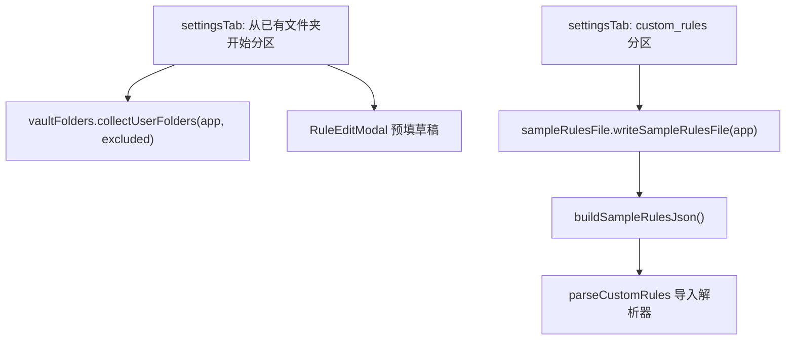

# Technical Design — 文件夹规则引导与设置体验优化

Feature Name: folder-rules-ux
Updated: 2026-09-16
Requirements: ./requirements.md

## Description

在设置面板新增「从已有文件夹开始」分区（扫描库内一级文件夹 + 笔记数量 + 一键建规则草稿），custom_rules.json 分区新增一键生成样例文件，全面重写设置面板与 README 文案为通俗语言。

## Architecture



数据流：display() 渲染时调用 collectUserFolders 扫描；「建规则」按钮构造预填 rule 对象走现有 RuleEditModal；「生成样例文件」按钮写库根文件后由现有导入流程消费。

## Components and Interfaces

### 1. src/services/vaultFolders.ts（新增）

纯逻辑与 Obsidian 依赖分层（沿用 seedMapping.ts 模式）：

```ts
// 纯函数（可测）
export interface UserFolder { path: string; name: string; noteCount: number }
export function filterUserFolders(
  folders: { path: string; noteCount: number }[],
  excludedFolders: string[]
): UserFolder[]
export const MAX_DISPLAY_FOLDERS = 50

// 薄层（Obsidian API）
export function collectUserFolders(app: App, excludedFolders: string[]): UserFolder[]
// 实现：app.vault.getRoot().children 过滤 TFolder → 递归统计 TFile(.md) 数量
// 排除：路径首段命中 isFolderExcluded（复用 seedMapping）或 == ".obsidian"/".trash"
```

递归计数辅助 `countMarkdownNotes(folder: TFolder): number` 同文件薄层内。

### 2. src/services/sampleRulesFile.ts（新增）

```ts
// 纯函数（可测）：生成样例 JSON 字符串
export function buildSampleRulesJson(): string
// 薄层：存在性检查（adapter.exists）→ vault.adapter.write
export async function writeSampleRulesFile(app: App): Promise<void>
// 覆盖确认由 settingsTab 弹 Modal 处理，服务层只负责写入
```

样例内容：description 用通俗语言说明规则构成；2 条示例规则（会议纪要→contains、日记→startsWith），id 用 `sample-` 前缀。

### 3. settingsTab.ts（修改）

- 新分区「从已有文件夹开始」（位于种子规则导入之后）：renderExistingFolders() 列表 + 每项「建规则」按钮 + 空状态文案
- 「建规则」→ `openRuleEdit({ name: 整理到X, field: fileName, operator: contains, pattern: folderName, targetFolder: path }, isNew=true)`，复用现有 RuleEditModal 与 onSave 刷新
- custom_rules 分区加「生成样例文件」按钮；已存在时 ConfirmModal 确认覆盖
- 文案重写：快速入门改三步（选引擎 → 建规则或从文件夹开始 → 一键整理）；全部分区一句话说明；移除 JSON 符号示例；导入按钮说明补「库里已有同名文件夹时自动使用现有文件夹」

### 4. README.md（修改）

设置面板相关章节口径同步；custom_rules.json 章节保留代码块示例，前面加通俗分步引导（含一键生成路径）。

## Data Models

复用 OrganizeRule。样例 JSON：

```json
{
  "formatVersion": 1,
  "description": "整理规则示例文件（可直接修改）。每条规则包含：规则名称、匹配字段（检查笔记的哪个部分）、匹配方式、匹配内容、目标文件夹（整理到哪里）。",
  "rules": [
    { "id": "sample-meeting", "name": "会议纪要", "field": "fileName", "operator": "contains", "pattern": "会议", "targetFolder": "会议记录", "weight": 0.8 },
    { "id": "sample-daily", "name": "日记", "field": "fileName", "operator": "startsWith", "pattern": "日记", "targetFolder": "日记", "weight": 0.9 }
  ]
}
```

RuleEditModal 预填草稿：现有 rule 参数直接承载，无需新类型。

## Correctness Properties

- P1（round-trip）：buildSampleRulesJson() 的输出必须能被 parseCustomRules 完整解析，且 2 条规则字段无损
- P2：filterUserFolders 输出不含排除清单命中的路径，且按 path 字母序、noteCount 降序排列
- P3：collectUserFolders 统计的 noteCount 只数 Markdown 文件
- P4：writeSampleRulesFile 在目标存在且用户取消时保持原文件字节不变

## Error Handling

| 场景 | 处理 |
|------|------|
| 库根无任何用户文件夹 | 分区显示空状态引导（「还没有文件夹，先在库里建一个，或用下方内置规则」） |
| custom_rules.json 已存在 | ConfirmModal 确认后覆盖（R3.2） |
| 文件写入抛错 | Notice 显示 e.message（R3.4） |
| 文件夹数超 50 | 截断 + 提示剩余数量（R1.4） |

## Test Strategy

沿用纯逻辑单测模式（tests 不 import obsidian）：

- tests/vaultFolders.test.ts：filterUserFolders 排除命中、排序（P2）、50 截断计数
- tests/sampleRulesFile.test.ts：buildSampleRulesJson round-trip（P1，调 parseCustomRules 断言 2 条规则字段）
- settingsTab UI 变更走 build + 现有回归测试保障

## References

- src/services/seedMapping.ts — isFolderExcluded 复用
- src/services/customRulesLoader.ts:parseCustomRules — round-trip 目标解析器
- src/settings/settingsTab.ts — 分区渲染与 RuleEditModal 打开路径
- .monkeycode/specs/existing-vault-adoption/design.md — 存量库融合前置设计
